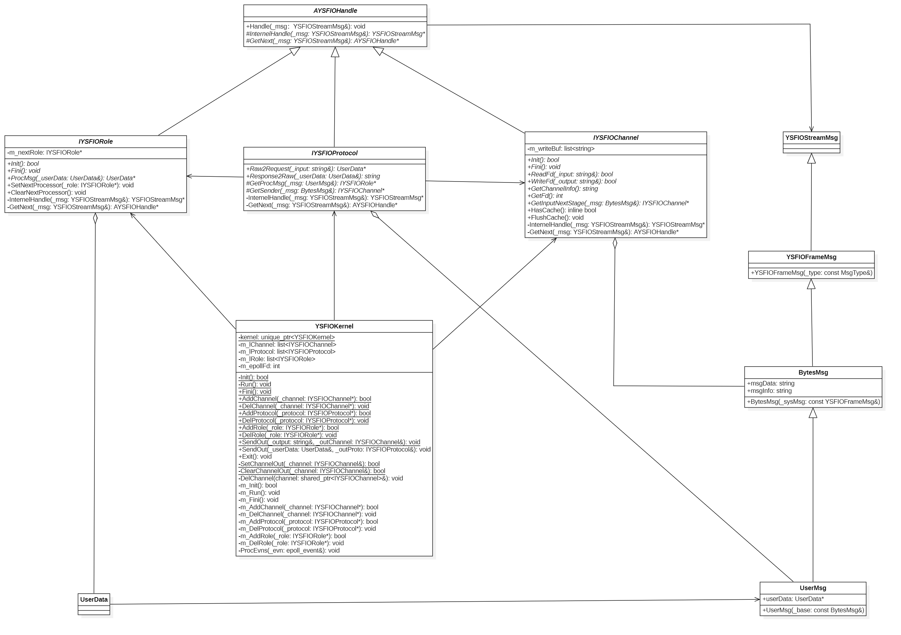
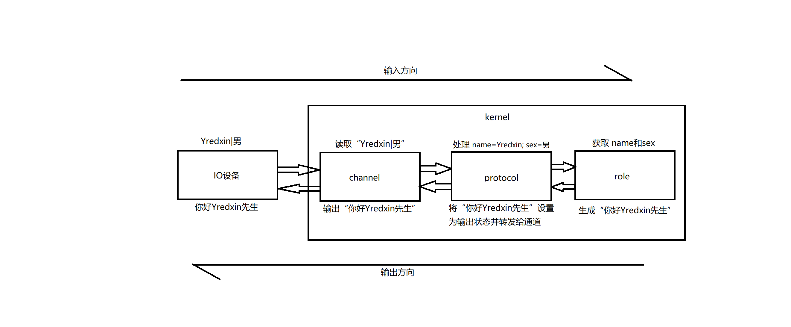
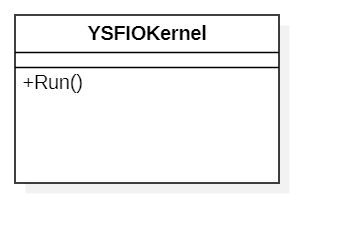
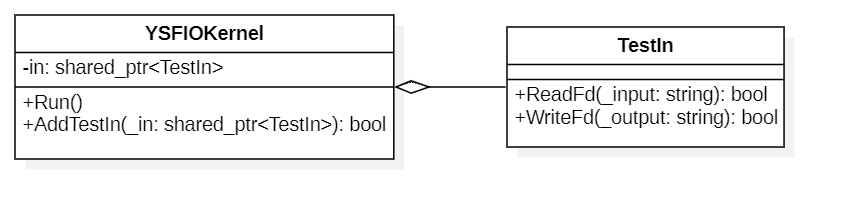
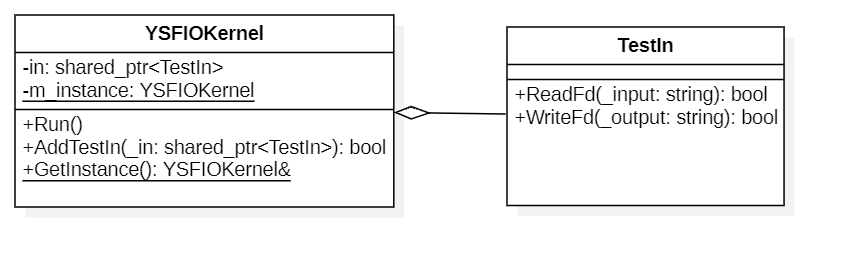
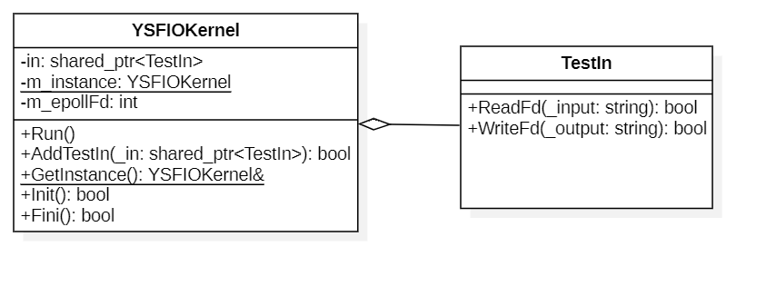
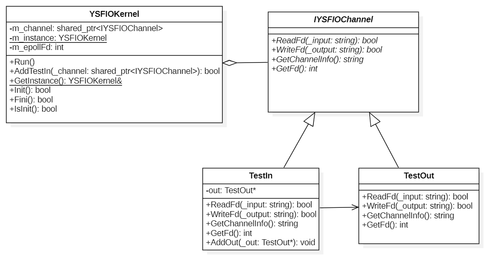
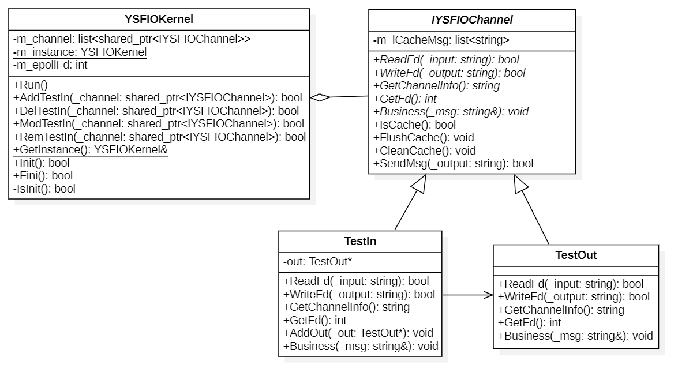
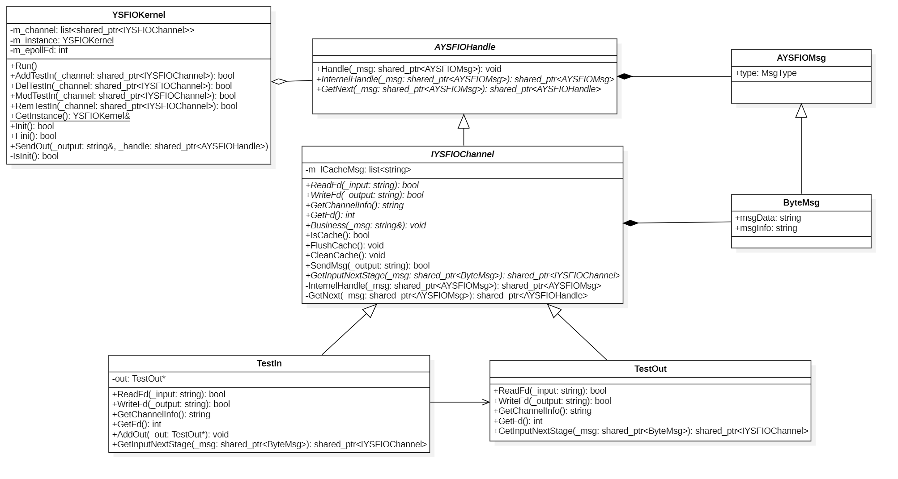
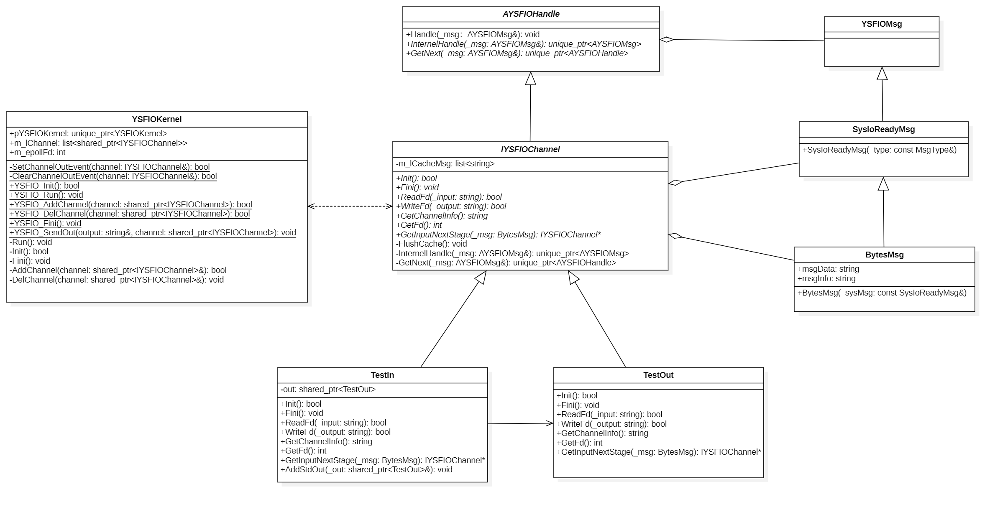

# YredxinSFIO
> 全称: *Yredxin Simple IO framework* (简单IO处理框架)  
> 学习与自[ZINX](https://github.com/marklion/zinx)框架 

# 目录结构
- [YSFIO](./YSFIO) ==> 为源码路径
- [example](./example) ==> 示例目录
- [UML](./UML) ==> 类图目录

# 类介绍
- YSFIOKernel -- 内核，框架主体
- IYSFIOChannel -- 输出通道抽象类，需要重写此类
- AYSFIOHandle -- 业务处理类，继承此类写出你的处理
- YSFIOMsg -- 责任链数据传递消息类
- SysIoReadyMsg -- 通道内部数据传递消息类
- BytesMsg -- 流式消息传递类，在个业务内相互

# 最新类图


# 迭代过程
> V1.0 框架搭建  
- V1.0 框架处理io数据 --> **YSFIOKernel**
- ~~V1.1 输入输出与框架分离~~
- ~~V1.2 将框架类变成全局单例~~
- ~~V1.3 高并发多路IO转接功能添加~~
- ~~V1.4 抽象输入输出类 --> **IYSFIOChannel**~~
- ~~V1.5 增加通道类功能~~
- ~~V1.6 采用责任链模式重构通道类 --> **AYSFIOHandle**~~
- ~~V1.7 代码重构，优化代码结构~~
> 内存管理问题，代码重构，开启V2.0
- V2.0 重构+扩展
    - 内存管理优化
    - 新增协议层 **IYSFIOProtocol**
    - 新增业务层 **IYSFIORole**
    - 消息对象重构

# 快速入门
> 注意：将通道/协议/角色需要堆上开辟，且添加到框架后，框架会吸收堆内存，不在需要释放
- 框架使用流程
    1. 调用*YSFIO::YSFIOKernel::Init*初始化框架数据
    2. 调用*YSFIO::YSFIOKernel::Run*运行框架
    3. 调用*YSFIO::YSFIOKernel::Fini*释放框架资源
- 通道处理
    1. 继承**YSFIO::IYSFIOChannel**类实现自己的通道处理
	2. 在执行*YSFIO::YSFIOKernel::Run*之前调用*YSFIO::YSFIOKernel::AddChannel*将您的通道实例对象加入框架中
- 协议处理
    1. 继承**YSFIO::IYSFIOProtocol**类实现自己的协议处理
	2. 在执行*YSFIO::YSFIOKernel::Run*之前调用*YSFIO::YSFIOKernel::AddProtocol*将您的协议实例对象加入框架中
- 角色处理
    1. 继承**YSFIO::IYSFIORole**类实现自己的业务处理
	2. 在执行*YSFIO::YSFIOKernel::Run*之前调用*YSFIO::YSFIOKernel::AddRole*将您的角色实例对象加入框架中
- 消息转换需要调用*GET_REF2DATA*将消息对象转化为自己需要的类型
    1. 参数1：为目标消息类型
	2. 参数2：为自定义变量名
	3. 参数3：为原始消息对象

# 示例
> 输入“姓名|性别”，输出“你好`姓名`先生/女士”
- 结构图
    
- 自定义消息类，继承**UserData**，暂存数据
    ```cpp
	class MyData :
		public YSFIO::UserData
	{
	public:
		std::string info;
		std::string name;
		std::string sex;
	};
	```
- 通道类实现，继承**YSFIO::IYSFIOChannel**，读写数据，代码如下：
    ```cpp
    class Channel :
		public YSFIO::IYSFIOChannel
	{
	public:
		IYSFIOProtocol* m_proto;
		// 通过 IYSFIOChannel 继承
		virtual bool Init() override
		{
			return true;
		}
		virtual void Fini() override
		{
		}
		virtual bool ReadFd(std::string& _input) override
		{
			std::cin >> _input;
			return true;
		}
		virtual bool WriteFd(std::string& _output) override
		{
			std::cout << _output << std::endl;
			return true;
		}
		virtual int GetFd() override
		{
			return 0;
		}
		virtual std::string GetChannelInfo() override
		{
			return "channel";
		}
		virtual AYSFIOHandle* GetInputNextStage(BytesMsg& _input) override
		{
			return m_proto;
		}
	};
    ```
- 协议层实现，继承**YSFIO::IYSFIOProtocol**，处理输入字符串，代码如下：
    ```cpp
	class Proto :
    	public YSFIO::IYSFIOProtocol
	{
	public:
		YSFIO::IYSFIOChannel* m_out;
		YSFIO::IYSFIORole* m_in;
		// 通过 IYSFIOProtocol 继承
		virtual UserData* Raw2Request(std::string& _input) override
		{
			UserData* retData = nullptr;
			if (!_input.empty())
			{
				MyData* data = new MyData;
				int pos = _input.find("|");
				if (0 <= pos)
				{
					data->name = _input.substr(0, pos);
					data->sex = _input.substr(pos + 1, _input.size() - pos - 1);
				}
				else
				{
					data->info = _input;
				}
				retData = data;
				data = nullptr;
			}
			return retData;
		}
		virtual std::string Response2Raw(UserData& _userData) override
		{
			GET_REF2DATA(MyData, oMyData, _userData);
			return oMyData.info;
		}
		virtual IYSFIORole* GetProcMsg(UserMsg& _msg) override
		{
			return m_in;
		}
		virtual IYSFIOChannel* GetSender(BytesMsg& _msg) override
		{
			return m_out;
		}
	};
    ```
- 业务层实现，继承**YSFIO::IYSFIORole**，生成需要输出的内容，代码如下：
    ```cpp
	class Role :
		public YSFIO::IYSFIORole
	{
	public:
		IYSFIOProtocol* m_proto;
		// 通过 IYSFIORole 继承
		virtual bool Init() override
		{
			return true;
		}
		virtual void Fini() override
		{
		}
		virtual UserData* ProcMsg(UserData& _userData) override
		{
			GET_REF2DATA(MyData, oMyData, _userData);
			if (oMyData.info == "exit")
			{
				YSFIOKernel::Exit();
			}
			else
			{
				if (oMyData.info.empty())
				{
					oMyData.info = "你好" + oMyData.name + ((oMyData.sex == "男") ? "先生" : "女士") + "！";
				}
				else
				{
					oMyData.info = "输入格式：姓名|性别";
				}
				YSFIOKernel::SendOut(oMyData, m_proto);
			}
			return nullptr;
		}
	};
    ```

# 迭代UML类图
- V1.0   
    
- ~~V1.1~~   
    
- ~~V1.2~~   
    
- ~~V1.3~~   
    
- ~~V1.4~~   
    
- ~~V1.5~~   
    
- ~~V1.6~~   
    
- ~~V1.7~~   
    
- V2.0   
    