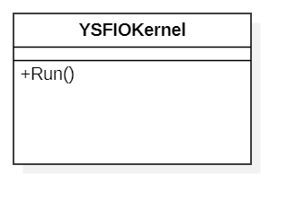
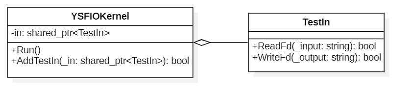
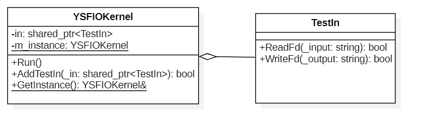
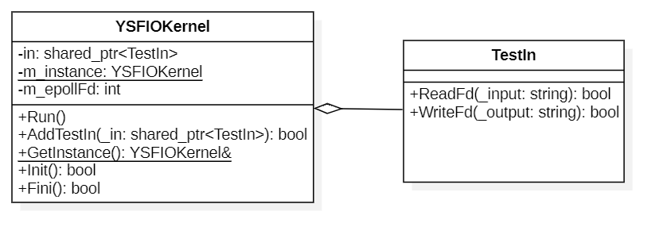
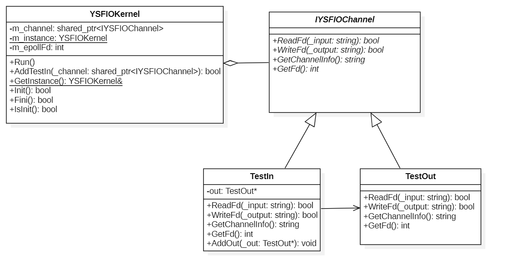
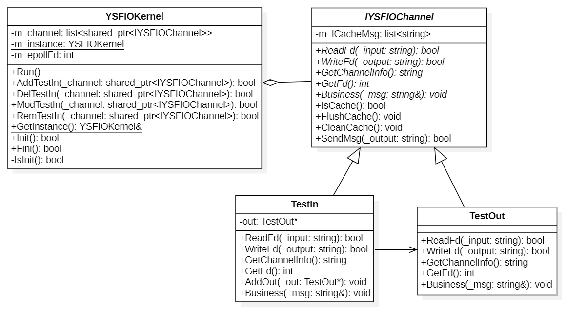
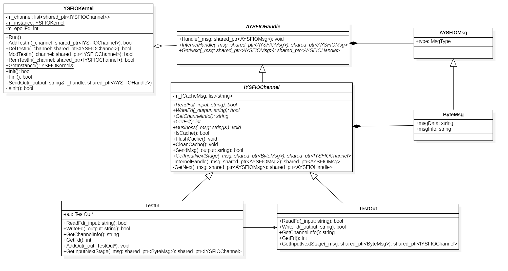
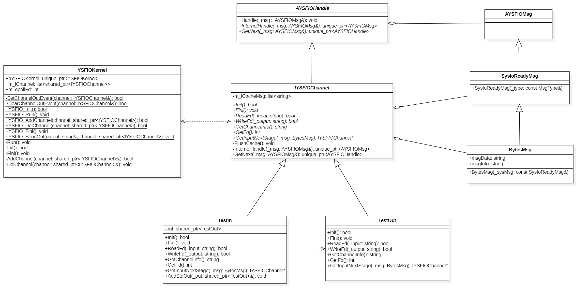

# YredxinSFIO
> 全称: *Yredxin Simple IO framework* (简单IO处理框架)  
> 为了隔离框架内所有类均属于***YSFIO***命名空间  

# 类介绍
- YSFIOKernel -- 内核，框架主体
- IYSFIOChannel -- 输出通道抽象类，需要重写此类
- AYSFIOHandle -- 业务处理类，继承此类写出你的处理

# 迭代过程
- V1.0 框架处理io数据 --> **YSFIOKernel**
- V1.1 输入输出与框架分离
- V1.2 将框架类变成全局单例
- V1.3 高并发多路IO转接功能添加
- V1.4 抽象输入输出类 --> **IYSFIOChannel**
- V1.5 增加通道类功能
- V1.6 采用责任链模式重构通道类 --> **AYSFIOHandle**
- V1.7 代码重构，优化代码结构，优化内存管理

# 迭代UML类图
- V1.0   
    
- V1.1   
    
- V1.2   
    
- V1.3   
    
- V1.4   
    
- V1.5   
    
- V1.6   
    
- V1.7   
    